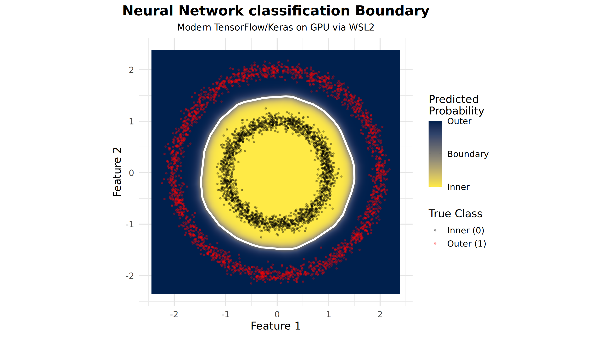

# R-Cyclopedia

[](https://www.r-project.org/)

[](https://medium.com/@vadimtyuryaev)
[](https://www.linkedin.com/in/vadimtyuryaev/)

---

## Goal

The **goal** of this repository is to provide a **fully executed R notebook** that serves as companion code to the Medium article: 
**"Mastering R for Data Science: Essential Tips, Hidden Tricks, and Pro-Level Coding Workflows 2026."**

The notebook covers six progressively advanced topics, ranging from foundational R mechanics and parallel computing to Python interoperability and GPU-accelerated deep learning. It includes complete, runnable code, inline comments, and output annotations throughout.

---


---

## Article

**Mastering R for Data Science: Essential Tips, Hidden Tricks, and Pro-Level Coding Workflows 2026**

[Read on Medium →](https://medium.com/@vadimtyuryaev/mastering-r-for-data-science-essential-tips-hidden-tricks-and-pro-level-coding-workflows-2026-07968149b7e2)


---

## Notebook

[Fully Executed Notebook →](https://vadimtyuryaev.github.io/R-Cyclopedia/)

---

## Topics Covered

| Section | Topic | Key Functions / Concepts |
|:-------:|:-------|:--------------------------|
| **0** | **Basics** | `assign()`, `get()`, `new.env()`, `eval()`, `parse()`, vector preallocation, `gc()` |
| **1** | **Functions** | Multi-return lists, ellipsis `...`, `do.call()`, nested functions |
| **2** | **Structures** | Matrix algebra (`%*%`), SVD from scratch, preallocated lists, Python-like dicts |
| **3** | **Iterations** | `apply()`, `lapply()`, `mapply()`, `sapply()`, lambda syntax `\(x)` |
| **4** | **Parallelism** | `parallel`, `future`, `makeCluster()`, `parLapply()`, `mclapply()`,`future_lapply()` |
| **5** | **Python Bridge** | `reticulate`, `py_run_string()`, `py$`, `import()` |
| **6** | **GPU Computing** | `tensorflow`, `keras`, Keras sequential models, non-linear classification |

---

## Article Section Highlights

### Section 0: Basics
Covers building blocks daily practitioners need: dynamic variable assignment with `assign()`/`get()`, R's lexical scoping model, custom environments, and `eval()`/`parse()` for metaprogramming. Includes a `microbenchmark` demonstration of vector preallocation yielding a **100× speedup** and memory lifecycle management with `gc()`.

### Section 1: Functions
Demonstrates returning multiple objects via named lists. Covers the ellipsis (`...`) for argument passing and `do.call()` for routing differing argument sets to multiple internal functions simultaneously.

### Section 2: Data Frames, Lists, Matrices, and Vectors
Covers structural manipulation including matrix algebra versus element-wise operations. A centerpiece is a **logistic regression neural network implemented from scratch** using only matrix operations (`%*%`, `t()`). Also covers SVD from first principles and environment-based Python-style dictionaries.

### Section 3: Vectorized Iterations
Maps each `apply` variant to its canonical use case: `apply()` for matrix margins, `lapply()` for list iteration (including `\(x)` lambda syntax), `mapply()` for broadcasting over multiple vectors, and `sapply()` for automatic simplification.

### Section 4: Parallel Computing
Uses a Monte Carlo π estimator to demonstrate sequential baseline vs. socket-based parallelism (`parLapply`) and fork-based parallelism (`mclapply`). Includes timing comparisons and a deep dive into avoiding hardware resource contention on memory-bound tasks.

### Section 5: Running Python Code in R
Demonstrates the full `reticulate` workflow: environment configuration, `py_run_string()` for inline Python, `py$` for bidirectional variable access, and data frame exchange between R and Python.

### Section 6: GPU Computing in R
Covers the complete setup path (CUDA/cuDNN → WSL2 → GPU TensorFlow → R Server → Environment/Profile Setup) and demonstrates a **non-linear classification** task trained on GPU and evaluated with a `ggplot2` decision boundary visualization.

---

# Core Stack

```
install.packages(c(
  "tictoc"            # Section 0: timing
  "microbenchmark",   # Section 0: benchmarking
  "ggplot2",          # Section 1  visualization
  "parallel",         # Section 4: parallel computing
  "future",           # Section 4: parallel computing
  "future.apply",     # Section 4: parallel computing
  "reticulate"        # Section 5: Python interoperability
))
```

::: {.note}
**Environment Requirements:**

Sections 0–5 require only base R and CRAN packages. 

Section 6 requires a CUDA-capable GPU, CUDA/cuDNN, and a configured GPU TensorFlow environment. For Windows users, this requires WSL2, an Ubuntu R Server, and specific library mapping detailed in **Chapter 6 of the Medium article.**
:::
